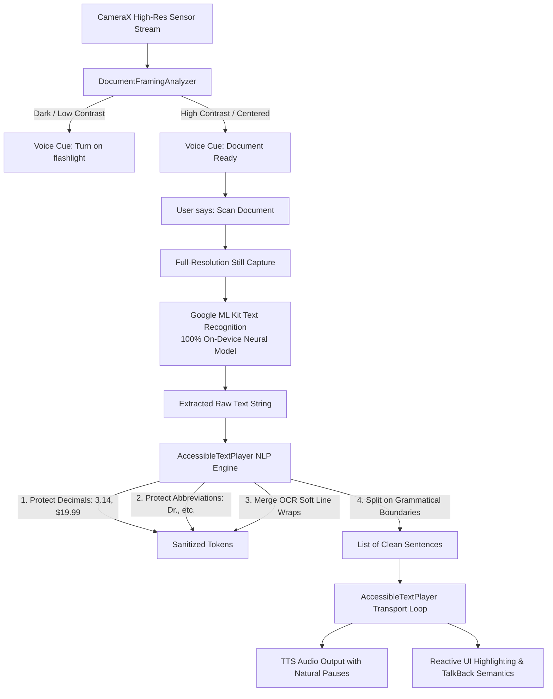

# Document Scanner & Accessible Reader: Complete Technical Guide

**Project:** AI Blind Assistant  
**Feature:** On-Device Document Scanner & Accessible Sentence-by-Sentence Reader  
**Classification:** 100% Offline, Privacy-Preserving, Blind Accessibility First  

---

## 1. Overview & Accessibility Purpose

The **Document Scanner** allows blind and visually impaired users to independently read physical documents, medicine labels, prescription bottles, food packaging, letters, books, and signage.

```
 +-------------------------------------------------------------------------+
 |                      DOCUMENT SCANNER WORKFLOW                          |
 |                                                                         |
 |   [Live Camera]  --->  [Framing Guidance]  --->  [ML Kit On-Device OCR]  |
 |          |                     |                         |              |
 |          v                     v                         v              |
 |   Real-Time Video      Luminance/Contrast         Text Extraction       |
 |   Analysis (YUV420)    Spoken Spacial Cues        (0 Cloud Upload)      |
 |                                                          |              |
 |                                                          v              |
 |   [Voice Control] <--- [Interactive Karaoke] <--- [NLP Sentence Engine] |
 |   - Instant Barge-in    - Visual Highlighting     - Rejoin Line Wraps   |
 |   - Pause / Resume      - Touch-to-Play           - Protect Decimals    |
 |   - Next / Previous     - Live Word/Sentence Cnt  - Preserve Abbrevs    |
 +-------------------------------------------------------------------------+
```

### Core Accessibility Principles:
1. **Real-Time Framing Guidance**: Live audio feedback helps the user center and align the document without needing sight.
2. **Grammatical Sentence Segmentation**: Natural Language Processing joins OCR line-wraps and preserves abbreviations (*Dr.*, *Mr.*, *e.g.*, *$19.99*) so reading is fluent and grammatically correct.
3. **Interactive Karaoke Player**: The user has full transport control to start, pause, resume, stop, jump to previous/next/first/last/numbered reading lines, or spell the selected line letter-by-letter.
4. **Hands-Free Barge-In Voice Control**: The user can speak voice commands (*"Pause"*, *"Repeat"*, *"Scan"*, *"Stop"*) while the phone is reading, and it responds with sub-50ms latency.

---

## 2. Technical Architecture & Processing Pipeline



---

## 3. Deep-Dive: Key Subsystems

### 3.1. Real-Time Document Framing Analyzer (`DocumentFramingAnalyzer`)
* **Luminance & Contrast Analysis**: Evaluates average luminance across 9 spatial grid zones on low-overhead camera preview frames.
* **Orientation & Spatial Prompts**:
  * `tooDark`: *"Too dark. Say Turn on flashlight."*
  * `tooBright`: *"Too bright. Tilt phone slightly."*
  * `moveHigher`: *"Move phone higher over document."*
  * `moveLower`: *"Move phone lower."*
  * `aligned`: *"Document aligned and ready to scan."*
* **Safety & Privacy**: Preview frames are analyzed in transient native memory buffers and immediately recycled; no images are cached.

### 3.2. On-Device Text Recognition Engine (ML Kit OCR)
* Runs **100% offline** on the device neural accelerator.
* Extracts UTF-8 character sequences, blocks, lines, and bounding boxes.
* Captures at high resolution (1080p / 4K sensor capability) to ensure small font sizes (e.g. medicine dosage instructions) are legible.

### 3.3. NLP-Grade Sentence & Line Tokenizer
Physical OCR produces fragmented line wraps (`\n`) due to column boundaries and paper dimensions. The app's tokenizer reconstructs grammatical unity:

```
[Raw OCR Input]
"Dr. Smith prescribed 2.5 mg of
aspirin. Take once daily after
breakfast. Do not exceed dosage!"

[NLP Processing]
1. Protect "Dr." and "2.5" from false period splits.
2. Detect that "of\naspirin" and "after\nbreakfast" are soft wrapped lines.
3. Merge line breaks into continuous grammatical sentences.

[Final Clean Sentences]
Sentence 1: "Dr. Smith prescribed 2.5 mg of aspirin."
Sentence 2: "Take once daily after breakfast."
Sentence 3: "Do not exceed dosage!"
```

### 3.4. Interactive Transport & Sentence Reader (`AccessibleTextPlayer`)
* **Sequential Narration**: Speaks each sentence individually, giving visual and audio focus to one thought at a time.
* **Pacing & Cadence**: Implements clean inter-sentence pauses (450ms normal, 600ms learning mode) that prevent cognitive fatigue and provide natural windows for voice barge-in.
* **Reading Profiles**:
  * 🎓 **Learning / Study Mode (0.35x rate, 600ms pause)**: Slower rate with deliberate cadence for medical prescriptions or legal terms.
  * 📖 **Normal Mode (0.50x rate, 450ms pause)**: Standard conversational reading speed.
  * ⚡ **Skim Mode (0.75x rate, 250ms pause)**: High-speed playback for scanning lengthy documents.
  * 🔤 **Spell-Out Mode**: Spells words character-by-character (*"A - s - p - i - r - i - n"*).

---

## 4. Complete Voice Action Matrix on Scanner Page

| User Voice Command | Action Executed | Accessibility Behavior |
| :--- | :--- | :--- |
| *"Scan document"*, *"Scan"*, *"Take photo"* | Captures and reads page | Freezes camera, runs OCR, starts reading sentence 1. |
| *"Pause"*, *"Hold on"* | Pauses player | Halts TTS immediately; saves current sentence index. |
| *"Start reading"*, *"Resume"*, *"Continue"* | Starts/resumes player | Starts from the selected line; a completed document restarts at line 1. |
| *"Stop reading"*, *"Quiet"*, *"Silence"* | Stops audio | Silences TTS, preserves the selected line, and keeps reader commands active. |
| *"Repeat"*, *"Say again"* | Repeats current sentence | Re-reads current active sentence aloud. |
| *"Next"*, *"Next sentence"* | Steps forward | Jumps to sentence `N + 1` and reads it. |
| *"Previous"*, *"Previous line"* | Steps backward | Jumps to reading line `N - 1` and reads from there. |
| *"First line"*, *"Start from beginning"* | Reads first line | Jumps to reading line 1 and starts speaking. |
| *"Last line"*, *"Final line"* | Reads final line | Jumps to and reads the final normalized reading line. |
| *"Go to line 5"*, *"Read sentence twenty one"* | Reads selected line | Uses a one-based reading-line number; focused voice supports 1-100. |
| *"Spell out"* | Spells current reading line | Reads every alphanumeric character in the selected line separately. |
| *"Restart"* | Restarts document | Selects reading line 1 and reads from start. |
| *"Study mode"* / *"Skim mode"* | Changes speech profile | Adjusts rate and inter-sentence pause dynamically. |
| *"Flashlight on"* / *"Torch off"* | Controls camera LED | Toggles hardware torch for optimal lighting. |
| *"Copy text"* | Clipboard export | Copies complete recognized text for use in other apps. |
| *"Ask AI"* | Summarization | Hands off text to Smart AI assistant for complex Q&A. |

---

## 5. UI Layout & TalkBack Semantics

```
 +---------------------------------------------------------+
 | [Status Pill] Scanner: Reading Text                     |
 +---------------------------------------------------------+
 | [PLAYBACK TRANSPORT CONSOLE]                            |
 | Line 1 of 3 (33%) • 42 Words            [Normal Speed]  |
 | [⏮️ Prev]       [⏯️ Pause/Start]       [⏭️ Next]        |
 | [First]          [Go to Line 1]          [Last]          |
 | [Stop Reading] [Repeat] [Spell Out] [Study/Normal/Fast] |
 +---------------------------------------------------------+
 | [HERO SPOTLIGHT READING CARD]                           |
| 🔊 NOW READING (LINE 1 / 3)                 [🛑 Stop]   |
 | "Dr. Smith prescribed 2.5 mg of aspirin."              |
 +---------------------------------------------------------+
 | [FULL DOCUMENT KARAOKE CARD]                            |
| 📄 Document Text (3 Reading Lines • 42 Words) [📋 Copy] |
 | (1) 🔊 "Dr. Smith prescribed 2.5 mg of aspirin."        |
 | (2)    "Take once daily after breakfast."               |
 | (3)    "Do not exceed dosage!"                          |
 +---------------------------------------------------------+
 | [ACTION BUTTONS]                                        |
 | [ 🔊 Read Again ] [ 📋 Copy Text ] [ ✨ Ask AI ]        |
 | [ 📷 Scan Another Page (Primary Hero) ]                 |
 +---------------------------------------------------------+
```

1. **High-Contrast Dark Theme**: Deep slate backgrounds (`#0F172A`, `#1E293B`) paired with high-contrast amber/cyan text ensures maximum legibility for low-vision users.
2. **TalkBack Live Regions**: Status changes and active reading sentences announce dynamically via `SemanticsService.sendAnnouncement`.
3. **Safe Post-Frame Rendering**: All sentence transitions use `WidgetsBinding.instance.addPostFrameCallback` and direct `Column` layouts to ensure 60fps smooth scrolling with zero Flutter rendering assertion errors.
