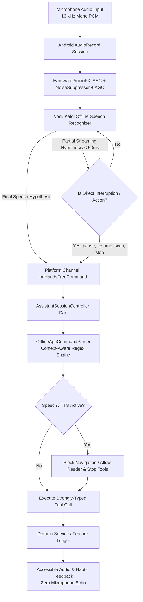

# Offline Vision AI Assistant: Complete Technical Architecture & Guide

**Project:** AI Blind Assistant  
**Platform:** Android (Flutter & Kotlin Native)  
**Classification:** 100% On-Device, Privacy-First, Real-Time Assistive Voice Engine  

---

## 1. Executive Summary & Core Philosophy

The **Offline Vision AI Assistant** is an on-device, hands-free conversational and command engine designed specifically for blind and visually impaired users. It delivers deterministic, zero-latency app control, real-time feedback, and accessible device operations **without requiring internet connectivity, cloud APIs, or external servers**.

```
 +-------------------------------------------------------------------------+
 |                       AI BLIND ASSISTANT ECOSYSTEM                     |
 |                                                                         |
 |  +---------------------------------+  +------------------------------+  |
 |  |    100% OFFLINE VISION AI       |  |     SMART AI (OPTIONAL)      |  |
 |  |   - Bundled Vosk Kaldi ASR      |  |   - Paired Private Laptop    |  |
 |  |   - Hardware AEC & Noise Suppr. |  |   - Local Whisper & Ollama   |  |
 |  |   - Deterministic Regex Engine  |  |   - Gemini Multimodal Fallbk |  |
 |  |   - 0ms Latency Device Control  |  |   - Complex QA & Reasoning   |  |
 |  +---------------------------------+  +------------------------------+  |
 +-------------------------------------------------------------------------+
```

### Key Architectural Pillars:
1. **100% Privacy & Data Sovereignty**: Voice audio is decoded entirely in RAM on the Android device; no raw audio or transcripts are ever transmitted to the cloud.
2. **Deterministic Command Routing**: Spoken controls map directly to strongly-typed internal Dart domain actions through deterministic parsing, completely eliminating LLM hallucinations or latency.
3. **Hardware-Accelerated Acoustic Echo Cancellation (AEC)**: Hardware DSP filtering isolates the user's voice from the phone's loudspeaker, allowing seamless voice interruptions (barge-in) while the app is speaking aloud.
4. **Sub-50ms Fast-Path Execution**: Critical assistive actions (*"stop"*, *"pause"*, *"resume"*, *"scan"*) execute on streaming partial speech hypotheses without waiting for conversational silence.

---

## 2. End-to-End Architecture & Data Pipeline

The voice engine operates across a high-performance native Kotlin subsystem and a reactive Flutter Riverpod state machine:



---

## 3. Subsystem Deep-Dive

### 3.1. Native Audio Capture & DSP Signal Conditioning
* **Audio Source**: `MediaRecorder.AudioSource.VOICE_RECOGNITION` (activates chipset beamforming microphones).
* **Sample Rate**: `16,000 Hz`, 16-bit Mono PCM.
* **Hardware Audio Effects**:
  * `android.media.audiofx.AcousticEchoCanceler`: Filters phone loudspeaker playback from the microphone buffer.
  * `android.media.audiofx.NoiseSuppressor`: Attenuates steady ambient background noise (fans, traffic, room hum).
  * `android.media.audiofx.AutomaticGainControl`: Normalizes human speech volume across varying distances (handheld vs pocket vs table).

### 3.2. Offline Speech Recognition Engine (Vosk Kaldi)
* **Model**: Bundled lightweight Kaldi acoustic model packaged directly inside Android assets.
* **Constrained Grammar**: In hands-free mode, Vosk utilizes an optimized JSON vocabulary covering all app commands, navigation terms, reader controls, and numbers, maximizing decoding speed and accuracy on low-end processors.
* **Continuous Streaming**: The recognizer runs as a low-overhead background thread with an Android partial wake lock, listening continuously without draining battery.

### 3.3. Deterministic Command Parser (`OfflineAppCommandParser`)
The parser evaluates normalized text against strict semantic intents while taking into account **active app route** and **vision detection status**:

| Input Intent | Matched Trigger Variations | Executed Tool | Context Behavior |
| :--- | :--- | :--- | :--- |
| **Stop / Silence** | *"stop"*, *"quiet"*, *"silence"*, *"mute"*, *"hush"* | `stop_speaking` / `stop_mobile_mode` | In Mobile Mode: stops camera. In Scanner: halts reading in pure silence. |
| **Scan Document** | *"scan"*, *"take picture"*, *"capture photo"*, *"read page"* | `trigger_ocr_scan` | Captures high-res photo and initiates ML Kit OCR. |
| **Pause Reading** | *"pause"*, *"pause reading"*, *"hold on"* | `reading_pause` | Freezes document reader at current sentence index. |
| **Resume Reading** | *"resume"*, *"continue reading"*, *"play"*, *"unpause"* | `reading_resume` | Resumes playback from exact saved sentence position. |
| **Repeat / Rewind** | *"repeat"*, *"say again"*, *"previous sentence"*, *"last line"* | `reading_repeat` / `reading_previous` | Navigates backwards across text units. |
| **Flashlight Toggle** | *"turn on flashlight"*, *"torch on"*, *"light on"*, *"torch off"* | `set_flashlight_enabled` | Hardware camera LED activation for low-light scanning. |
| **App Navigation** | *"open settings"*, *"go home"*, *"open smart ai"*, *"open modes"* | `navigate_to_screen` | Safe screen transitions (locked during active document playback). |
| **Device Utilities** | *"battery level"*, *"what time is it"*, *"what is the date"* | `get_battery_status` / `get_current_time` | Announces current phone status without internet. |

---

## 4. Voice Command Reference Guide

### 📸 Document Scanner Commands
* *"Scan document"*, *"Scan"*, *"Take photo"*, *"Capture page"*, *"Read text"*
* *"Pause"*, *"Pause reading"*, *"Hold on"*
* *"Resume"*, *"Continue reading"*, *"Play"*
* *"Repeat"*, *"Read again"*, *"Say again"*
* *"Next"*, *"Next sentence"*, *"Next line"*
* *"Previous"*, *"Previous sentence"*, *"Last line"*
* *"Spell out"*, *"Spell word"*, *"Spell current"*
* *"Restart reading"*, *"Start from beginning"*
* *"Study mode"*, *"Slow speed"*, *"Normal speed"*, *"Fast speed"*
* *"Copy text"*, *"Flip camera"*, *"Scan another page"*

### 🚶 Mobile Obstacle Detection Commands
* *"Start mobile mode"*, *"Start detection"*, *"Open camera"*
* *"Stop mobile mode"*, *"Stop detection"*, *"Turn off vision"*
* *"Pause detection"*, *"Resume detection"*
* *"What is in front of me"*, *"Read recent detections"*
* *"Outdoor mode"*, *"Indoor mode"*, *"Auto environment"*

### 📱 System & Utility Commands
* *"Check battery"*, *"Battery level"*, *"Battery percentage"*, *"How much battery"*
* *"What time is it"*, *"Tell me the time"*, *"Current time"*
* *"What is today's date"*, *"What day is it"*, *"Today's date"*
* *"Flashlight on"*, *"Torch on"*, *"Turn off flashlight"*
* *"Vibration on"*, *"Turn off vibration"*, *"Audio feedback only"*

### 🌐 Smart AI & Remote Features
* *"Open Smart AI"*, *"Talk to Smart AI"*, *"Ask AI"* (Switches to paired laptop backend for complex questions).
* *"Raspberry Pi status"*, *"Connect to Raspberry Pi"*, *"Start wearable mode"*.

---

## 5. Noise Rejection & Echo Prevention Rules

To guarantee a frustration-free assistive experience, the assistant follows strict conversational rules:

1. **Zero Spoken Echo on Stop/Quiet**: Stop commands execute **pure instant silence** without vocal confirmation (*"Speech stopped."*), preventing microphone feedback loops.
2. **Silent Ambient Rejection**: Background speech or ambient noise that does not match an intentional app command is **silently discarded** without interrupting the user with long error lectures.
3. **Screen Navigation Lock During Audio Output**: While text is being read aloud, navigation tools are blocked so words inside documents (like *"settings"*, *"home"*, *"safety"*) cannot trigger accidental screen switching.
4. **Intentional Phrase Requirement**: Short isolated words like *"battery"* or *"time"* require full intent phrases (*"check battery"*, *"what is the time"*) to prevent false triggers from similar-sounding phonemes.
